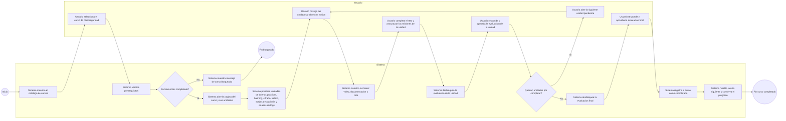

# HU-19 - Diagrama de proceso del curso de ciberseguridad

## Resumen de la HU

- El curso solo queda disponible cuando el usuario completa `Fundamentos de Python`.
- El flujo del curso cubre unidades sobre buenas practicas, hashing, cifrado, analisis de trafico, scripts de auditoria y cierre con analisis de logs.
- Al completar las misiones de cada unidad, se habilita su evaluacion.
- Al aprobar todas las unidades, se habilita la evaluacion final.
- Al aprobar la evaluacion final, el sistema marca el curso como completado y conserva el progreso.
